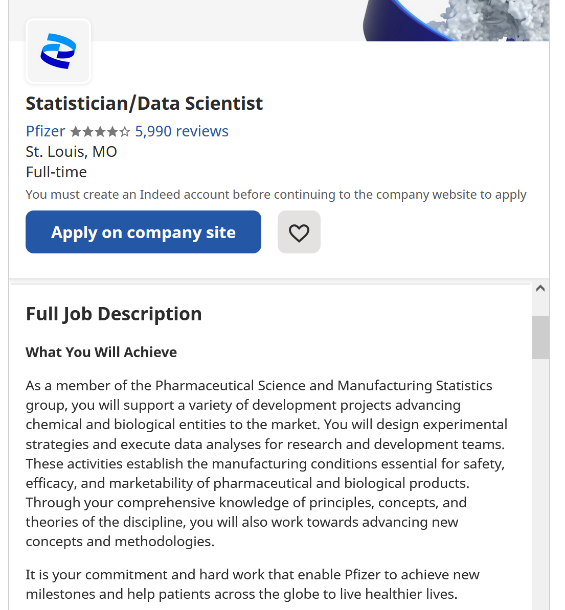
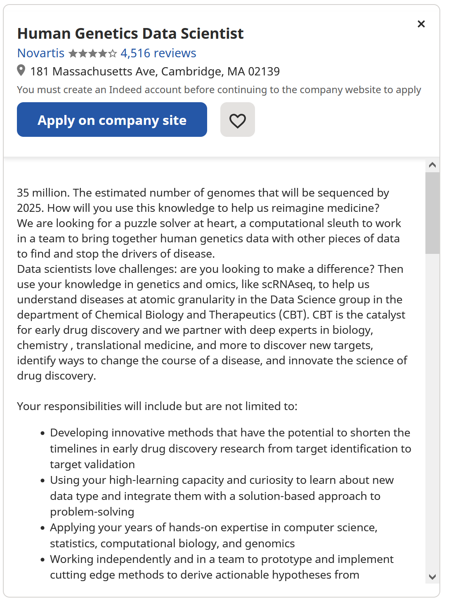

# Task 1: Data Science Careers

I'm interested in the jobs below all for different reasons. The Novartis job is interesting because genomics is a field with tons and tons of data, and I think it would be fun exploring all the different angles to look at that much data. The Nordstrom job is interesting because I've actually always wondered how Nordstrom customer service is so good, so I'd be interested to contribute the continuation of that work environment. The Pfizer job looks interesting because my main field of study is neuroscience, so I think it would be a good blend of my data science and health science interests. 

# Task 2: Highs and Lows

I enjoyed this class a lot! It has already been a big help in my neuroscience research. 
I would have appreciated a bit more well-defined structure. A week per assignment is a bit too short, and it was disorienting not knowing when the lectures would be released.
I definitely have already employed a lot of techniques from this class in my lab, and it's been especially helpful for making sure our data is open-science ready because I know now what's good and what's bad for further data analytics projects!